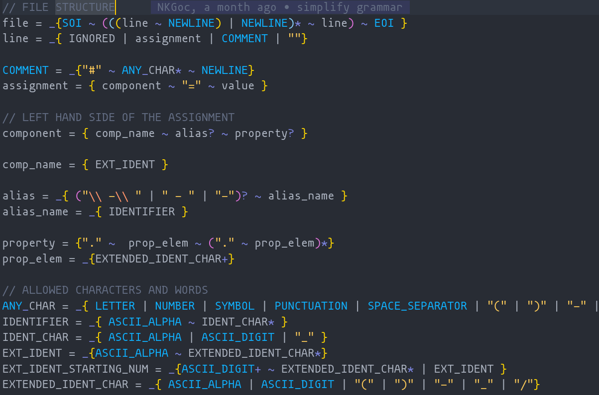

# Cargo-cubemx

### Formal Languages and compilers project summary

---

# Project topic

An .ioc to Rust compiler named cargo-cubemx.

- __CubeMX__ - software provided by ST to simplify the development with STM32 MCUs
- __ioc__ - one of output files of CubeMX software which describes configuration
  of the MCU.
- __Rust__ - a compiled programming language with C-like performance and
higher-level abstractions
- __Cargo__ - a build tool used with Rust

---

# Project goals

- Parse .ioc file
- Output a file which can be used as a Rust module
- Use existing HAL libraries as compilation targets
- Have the project work as a cargo extension

---

# Source file and output file

---

## Source file (.ioc)

#### Where does it come from?

The .ioc is an extension of a configuration file produced by STM32CubeMX software. CubeMX uses the file in further code generation. It is possible to obtain from .ioc configuration files for other STM32 tools and C code. 


---

## Source file (.ioc)

#### Where does it come from?


---

## Source file (.ioc)

### Contains:

MCU description
```
Mcu.Family=STM32F4
Mcu.IP0=ADC1
Mcu.IP1=CAN1
#...
Mcu.Package=LQFP100
Mcu.Pin0=PH0 - OSC_IN
Mcu.Pin1=PH1 - OSC_OUT
Mcu.Pin10=PA4
Mcu.Pin11=PA5
```

---

## Source file (.ioc)

### Contains:

Clocks configuration:
```
RCC.AHBFreq_Value=75000000
RCC.APB1CLKDivider=RCC_HCLK_DIV2
RCC.APB1Freq_Value=37500000
RCC.APB1TimFreq_Value=75000000
```

---

## Output file (Rust)

```rs
pub fn init_DMA1_Stream3(per: impl DMASet + PeriAddress, buf: impl StaticWriteBuffer) ->
 Transfer<StreamX<DMA1>, dyn DMASet<StreamX<DMA1>, PeripheralToMemory> + PeriAddress, PeripheralToMemory, 3> {
    let dp = pac::Peripherals::take().unwrap();
    let dma = dp.DMA1;
    let stream = dma::StreamsTuple::new(dma).3;
    let config = dma::config::DmaConfig::default()
    .priority(dma::config::Priority::Low)
    .memory_increment(true)
    ;
    dma::Transfer::init_peripheral_to_memory(
    stream,
    per,
    buf,
    None,
    config
    )
}
```

---

# Compiler data flow

From input to output:
1. Pest library using PEG is used to perform simple decmposition of the input
   lines and filtering of not implemented elements
2. Data is read into hashmap and then structures collecting configuration of
   each component (where component is a token of accepted grammar)
3. Structures are read and code templates are filled using logic dependent on target.

---

# PEG grammar



---

# Goals realization

## Parsing .ioc

Having input as following:


---

# Goals realization

## Parsing .ioc

Data in the structures:

```rs
struct Dma {
    dma_instance: "DMA2_Stream1",
    signal: "MEMTOMEM",
    channel: "0",
    priority: DmaPriority::Low,
    direction: DmaDirection::MemoryToMemory,
    fifo_mode: true,
    mem_inc: true,
    per_inc: true,
}
```

---

# Goals realization

## Parsing .ioc

Currently supported are:
- USART receivers and transmitters initialization
- Direct Memory Access transfer initialization

---

# Goals realization

## Output as a Rust module


To use it your source just add:
```
mod <output_file_name>;
```

---

# Goals realization

## Use existing HAL libraries as compilation targets

Currently supported is only F4 family of MCUs and its HAL implementation as stm32f4xx-hal crate. 

---

# Goals realization

## Have the project work as a cargo extension


---

# Difficulties met

1. Late in the project it has been noticed that CubeMX does not mention some configuration elements in its output file if their value is equal to some default.
2. Information from multiple lines must be analyzed together - language is context sensitive.
3. .ioc description of MCU uses incosistent naming conventions and has incosistent aliasing syntax. 

---

# Thank you for your attention!